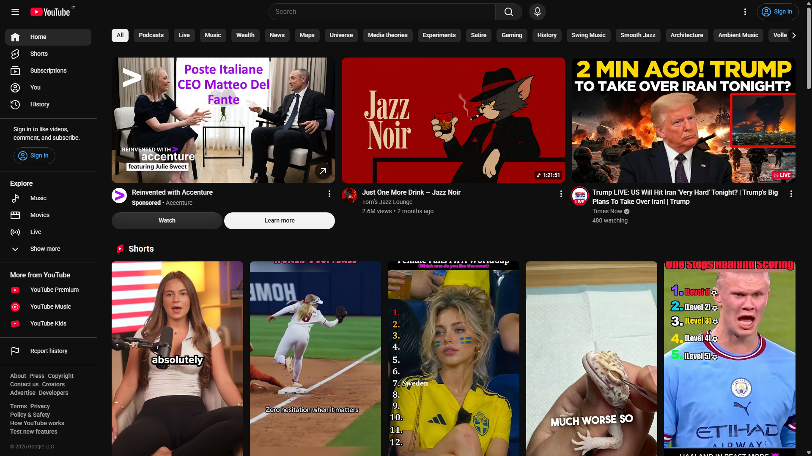

YouTube's homepage has two habits that annoy me every day: it wastes space, and it recommends the same videos over and over again.

I got tired of accepting both decisions, so I built two Chrome extensions. [YouTube Grid Layout Changer](https://github.com/R4ULtv/youtube-grid-layout-changer) gives me a denser, responsive video grid. [Paco](https://github.com/R4ULtv/paco) remembers which videos YouTube has already shown me, displays the number on each thumbnail, and can hide a video after YouTube has pushed it too many times.

Neither extension tries to replace YouTube. They change a few specific things that YouTube does not let me control.

## YouTube decides how much of my screen I am allowed to use

On a desktop monitor, YouTube's default homepage can feel strangely sparse. The thumbnails are large, only a few recommendations fit on screen, and seeing more means scrolling through a feed that already repeats itself too often.



_YouTube's default homepage uses most of the width for three recommendations._

I prefer four or five videos per row, depending on the available width. I can scan more titles at once, the thumbnails remain large enough to understand, and my monitor stops feeling like an oversized phone.

That preference became YouTube Grid Layout Changer. It is almost comically small: a Manifest V3 extension, one stylesheet, and no JavaScript.

## A CSS variable controls the entire YouTube grid

YouTube already exposes the value needed to change its layout:

```css
ytd-rich-grid-renderer {
  --ytd-rich-grid-items-per-row: var(--ytgc-items-per-row) !important;
}
```

The extension sets its own variable at responsive breakpoints:

```css
:root {
  --ytgc-items-per-row: 1;
}

@media (min-width: 768px) {
  :root {
    --ytgc-items-per-row: 2;
  }
}

@media (min-width: 1024px) {
  :root {
    --ytgc-items-per-row: 3;
  }
}

@media (min-width: 1366px) {
  :root {
    --ytgc-items-per-row: 4;
  }
}
```

The current defaults stop at four columns, which is the balanced option for most screens. On an ultrawide monitor, changing the final breakpoint to five or six columns takes one line.

There is one less obvious detail. YouTube renders loading skeletons before the real video cards appear, and those placeholders use a separate flex layout with inline widths. Changing only the rich grid makes the page jump when the actual content loads.

The extension applies the same column count to the skeleton container:

```css
#home-container-media {
  display: grid !important;
  grid-template-columns:
    repeat(var(--ytgc-items-per-row), minmax(0, 1fr)) !important;
  column-gap: 16px;
}
```

This keeps the loading state and the final grid aligned. The implementation is still just CSS, but it does not look unfinished while YouTube is loading.

## A better grid exposed the more irritating problem

Fitting more videos on screen made YouTube's repetition easier to notice.

I kept seeing a familiar thumbnail and wondering whether it was actually the same video. Had YouTube recommended it twice? Five times? Was I imagining it?

I wanted the homepage to answer that question directly. Every card should say either `NEW` or show a count such as `4x`. If a recommendation crosses a limit I choose, I should be able to remove it from the feed.

That idea became Paco.

## Paco counts a video only when I could have seen it

Counting every video found in the page's HTML would produce misleading data. YouTube lazy-loads cards, reuses parts of the page during navigation, and may place recommendations in the document before they enter the viewport.

Paco therefore separates discovering a video from counting a sighting:

```text
YouTube adds or changes cards
            |
            v
MutationObserver schedules a scan
            |
            v
Scraper extracts valid video IDs
            |
            v
IntersectionObserver waits until a card is 50% visible
            |
            v
IndexedDB records one sighting for the current session
            |
            v
Paco renders NEW / 2x / 3x or hides the card
```

A `MutationObserver` watches YouTube's changing DOM and schedules a debounced scan. The scraper looks through `ytd-rich-item-renderer` elements, extracts 11-character video IDs from watch links, and ignores playlist cards.

Each valid card is then registered with two `IntersectionObserver` instances.

The first observer preloads the existing count when a card is within 300 pixels of the viewport. That gives Paco time to decide whether the card should be visible before I reach it.

The second observer records a sighting only after at least 50% of the card is visible. A video hidden far down the page does not count merely because YouTube downloaded it.


## Sessions stop one recommendation from counting itself twice

YouTube is a single-page application. Navigating away from the homepage and back does not always create a completely new document, and DOM mutations can cause the same card to be processed repeatedly.

Paco creates a random session ID and stores sightings with a compound key:

```typescript
interface Sighting {
  videoId: string;
  seenAt: Date;
  sessionId: string;
}

// IndexedDB key:
// [videoId + sessionId]
```

The compound key means one video can only be inserted once per session. If another scan reaches the same card, IndexedDB rejects the duplicate and Paco leaves the count unchanged.

When YouTube navigation changes the URL, Paco generates a new session ID. If the same recommendation becomes visible on a later visit to the homepage, that is a new sighting and the count increases.

This is a small distinction, but it defines what the number means. `5x` means Paco saw YouTube place that video in front of me during five separate feed sessions. It does not mean five internal render events happened.

## The history lives in IndexedDB and expires after 90 days

Paco stores sightings locally in IndexedDB through [Dexie](https://dexie.org/). It does not send analytics, use a backend, or require an account.

The database has one table. It is indexed by video ID for fast counts, by session ID for deduplication, and by timestamp for cleanup. On startup, Paco deletes sightings older than 90 days.

Keeping a limited history is deliberate. A recommendation returning after three months is not the same annoyance as seeing it six times this week, and an unlimited log would keep growing for little benefit.

Local storage also creates a clear privacy boundary. Paco knows something about my YouTube feed, but only my browser can read that history.

The trade-off is that counts do not sync between devices or browser profiles. Sync would require accounts, a database, conflict handling, and a much larger security surface. That is too much machinery for an extension whose job is to put a number on a thumbnail.

## The badge looks like it belongs on YouTube

Paco places its badge next to YouTube's duration badge and reuses the page's existing badge classes when possible. A new video gets a red `NEW` label. Repeated videos show `2x`, `3x`, and so on, with different severity styles as the number grows.

This sounds cosmetic, but browser extensions can easily look like foreign objects pasted over a page. Reusing YouTube's badge structure helps Paco survive layout changes and makes the extra information feel native to the thumbnail.

There is also a fallback. If Paco cannot find YouTube's duration badge, it positions its own badge inside the thumbnail overlay instead of failing silently.

## Tracking is useful, but filtering gives the number a consequence

Paco has two modes:

- **Logs** marks every recommendation but leaves the feed unchanged.
- **Block** hides videos after their count passes a configurable threshold.

The threshold can be set from 5 to 20 sightings, with 10 as the default. Settings are stored with `chrome.storage.local`, and changes are applied to the open homepage immediately.

The comparison uses `count > threshold`. With a threshold of 10, the tenth appearance remains visible and the eleventh is hidden. That behavior gives the number an intuitive meaning: tolerate this video ten times, then stop showing it.

I kept Logs as the default because hiding recommendations is a stronger intervention than labeling them. It is useful to observe YouTube's behavior first and choose a limit based on how repetitive the feed actually is.

## Both extensions are intentionally narrow

The grid extension could grow a settings page with sliders, presets, per-monitor configuration, and a JavaScript resize listener. Paco could add cloud sync, charts, exports, channel filters, and a dashboard full of statistics.

Those features would also make both projects harder to understand and maintain.

The grid extension works because responsive CSS already solves the problem. Paco is more involved because deciding whether somebody has actually seen a recommendation requires state and visibility tracking, but it still has no server and asks only for YouTube access and local storage.

Their narrowness is the point. One fixes density. The other fixes repetition. Together, they make the YouTube homepage feel less like a feed I have to accept and more like a tool I can adjust.

## Install the extensions

Both projects are open source and can be installed as unpacked Chrome extensions:

1. Download the latest release from [Paco](https://github.com/R4ULtv/paco/releases/latest) or [YouTube Grid Layout Changer](https://github.com/R4ULtv/youtube-grid-layout-changer/releases/latest).
2. Unzip the downloaded package.
3. Open `chrome://extensions`.
4. Enable **Developer mode**.
5. Select **Load unpacked** and choose the unzipped folder.

If YouTube has also been wasting space or recommending the same unwatched video until it becomes a threat, try the extensions and open an issue with anything that breaks. YouTube changes its DOM often, so real-world reports are the most useful kind of feedback.
