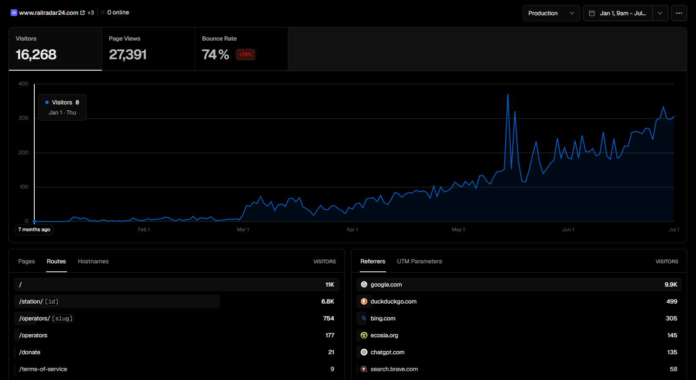
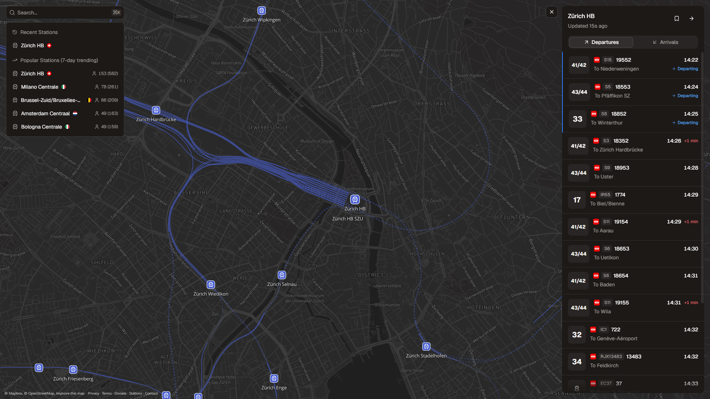

Rail Radar has become the first project I have built that people use without knowing me first. They find a station through Google, check the next departure, and come back when they need it again.

That is a small sentence, but it changes how I think about the project. Traffic has tripled in three months, the interface has evolved around how people actually use it, and Rail Radar is now large enough to have some modest running costs of its own.

## The graph finally started moving

For the first few weeks, Rail Radar's analytics looked like most side-project analytics: a few visits after launch, long flat sections, and occasional spikes when I shared an update.

Then the baseline began rising.

Since January, Vercel has recorded **16,268 visitors** and **27,391 page views**. More importantly, daily traffic is no longer returning to zero after each spike. By July, Rail Radar was regularly seeing around 300 visitors a day.

The product analytics tell the same story from a different angle. My [first public traffic report](https://www.railradar24.com/report/2026-04-28), covering late January to late April, recorded **22,459 station visits from 2,561 unique visitors**.

The [second report](https://www.railradar24.com/report/2026-07-24) covers the following rolling 90-day window:

- **69,665 station visits**, up 210%
- **13,076 unique visitors**, up 411%
- **13 countries** with active usage
- **47,449 departure views** and **22,216 arrival views**

Vercel visitors, page views, and Rail Radar station visits are different measurements, so they should not be added together. The Vercel screenshot describes traffic to the website, while the reports measure how people use individual station boards. Both show the same direction: the audience is growing, and it is growing faster than repeat usage.

## Rail Radar is becoming an international product

The original version of Rail Radar only covered Italy. The map now includes live railway data from across Europe, and the audience has followed that expansion.

Germany recorded 18,710 station visits in the latest report, ahead of Italy at 15,721 and Switzerland at 9,185. Every country that appeared in both reports grew. France and Poland appeared for the first time, while Ireland grew from 330 to 3,644 visits.

The station data is even more interesting. Zürich HB reached 1,036 unique visitors, the widest audience of any station. Milano Centrale remained one of the strongest recurring stations with 3,791 visits, and Cork Kent reached 566 unique visitors.

These are not just launch-day clicks. People are opening the map to answer a real question about a real journey.

## The homepage changed with the audience

The first version of Rail Radar was mostly a technical demonstration. It proved that I could normalize several national railway APIs and put thousands of stations on one map.

The current version has to work as a product. Search is more prominent, recent and popular stations are immediately available, railway lines are visible on the map, and the departure panel makes the useful information easier to scan. The interface also has to work for someone who arrives directly from a search engine and has no idea how the project was built.

That is the biggest visual change since my [original Rail Radar post](/blog/rail-radar). The architecture still matters, but users do not visit because the API runs on Cloudflare Workers or because the frontend uses Next.js. They visit because they need to know whether their train is leaving from platform 32.

Growth has made me much less interested in features that look impressive and much more interested in details that remove friction.

## What it costs to run Rail Radar

Free tiers are perfect while a project is an experiment. Rail Radar was cheap to run when only a few people opened it each day, and that made it possible to build without first finding a business model.

As usage increased, I moved Rail Radar to Vercel's **$20 per month plan**. It is a manageable amount, and I am sharing it because I want to be transparent about what happens when a side project starts receiving meaningful traffic.

Traffic, builds, server-side rendering, analytics, and live requests now happen continuously. Rail Radar also depends on map infrastructure, a Cloudflare API, analytics, and multiple external railway providers. Some of these still fit comfortably within their free tiers, and the exact cost will change as usage grows.

The latest report shows that the underlying providers are mostly reliable under the higher demand, but it also shows where the operational work is growing. RFI served 15,941 requests in the latest window, with a p95 response time above seven seconds.

This is the first time one of my projects has made maintenance feel as important as building. I now spend more time thinking about reliability, abuse, provider failures, and usage limits. That is a good problem to have: it means the project has moved beyond a launch and developed an audience of its own.

## An optional way to support the project

I do not want to put basic live departure information behind a subscription. Rail Radar is most useful when anyone can open it quickly, without an account or a payment screen.

I have added a [donation page](https://www.railradar24.com/donate) for anyone who finds Rail Radar useful and wants to contribute to its development. Donations help offset the infrastructure costs and give people who use the project a simple way to support it.

There is no locked feature or supporter tier attached to it, and there is no expectation that every user should donate. The project remains free and [open source](https://github.com/R4ULtv/rail-radar). Sharing it, reporting a problem, or contributing code is just as useful.

For me, the important part is that Rail Radar has become the first thing I have built with a real, recurring audience. Being open about the numbers and costs feels like the right way to document that progress.

You can [open Rail Radar](https://www.railradar24.com), read the two public traffic reports, or [support the project](https://www.railradar24.com/donate) if you would like to be part of where it goes next.
