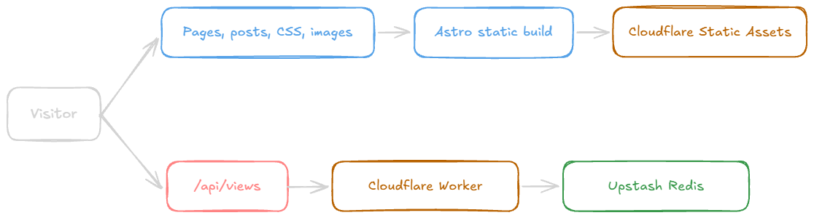

I rebuilt this website twice in eight months. The latest rewrite moved it from Next.js and Vercel to Astro and Cloudflare in three days.

That sounds excessive, and maybe it is. The previous version was not broken. It was fast, the traffic was low, and Vercel handled it without any problem. But the more I thought about how the site was hosted, the less comfortable I became with the architecture around something that is almost entirely static.

So, over three days, I moved the website from Next.js to [Astro](https://astro.build), replaced Vercel with [Cloudflare](https://www.cloudflare.com), migrated the content and components, and kept the few dynamic features I still wanted. The complete change is in [`pull request #29`](https://github.com/R4ULtv/raulcarini.dev/pull/29): 237 files changed, with more than 10,000 lines added and 7,000 removed.

## Vercel worked, but its cost model made me uncomfortable

I still like Next.js, and I still think Vercel is a very good company with an excellent product. The developer experience is difficult to beat: connect a repository, deploy it, and almost everything just works.

My concern starts when a project moves beyond the free plan. Vercel's Pro plan has many small metered features and usage limits. Each one makes sense on its own, but together they create more ways for a mistake, a traffic spike, or an unexpected workload to produce a bill I did not plan for.

That was not happening to this website. It receives little traffic, and this migration was not a reaction to an expensive invoice. It was about trust and predictability. I do not want to think about whether a new feature, a bot, or a configuration mistake could quietly turn into an infrastructure cost.

For a business application, those tradeoffs may be completely reasonable. For a personal website made mostly of HTML, CSS, images, and blog posts, they felt unnecessary.

Cloudflare is a much better fit for what this site actually is. The content pages can be generated ahead of time and served as static files, while the small dynamic part, the page-view API, runs separately on Cloudflare Workers. I get the network and tooling I need without designing the whole website around a server runtime.

The deployed system now has a clear split between static content and the one feature that needs a runtime:

This is the architecture I wanted:

- blog posts and pages are static;
- JavaScript is used only where it adds something;
- the page-view counter is isolated behind a Worker API;
- hosting has a cost model I feel more comfortable building on.

## Astro makes static output the default

Astro matched this static-first model immediately. Most of the website does not need React or a server-rendering framework. It needs to turn MDX files into HTML, optimize assets, and add a small amount of interactivity for features such as the theme switch.

With Astro, static output is the default rather than an optimization I have to work toward. Blog posts live in a type-safe content collection, so invalid frontmatter fails during the build. The pages are prerendered, while `/api/views` remains available as an on-demand Cloudflare route.

The migration also gave me a chance to simplify parts of the site:

- React components became Astro components;
- the old content setup became an Astro content collection;
- GitHub data is fetched in the browser and cached locally;
- tweets are resolved at build time;
- RSS, the sitemap, and metadata are generated from the same post data;
- the fonts are self-hosted;
- the Cloudflare configuration lives in the repository.

I also kept the features that made the previous version feel like my website: MDX posts, syntax highlighting, dynamic Open Graph images, GitHub contributions, page views, dark mode, and the yearly recap.

Those features still exist, but I can now see which ones need runtime code and which ones are just build-time work.

## How the Astro rewrite fit into three days

The rewrite started on July 26 and was merged on July 28.

On the first day, I removed the legacy scaffolding, initialized Astro, moved the assets and blog posts, and rebuilt the main layout and components. This established the static site and proved that the content could move without losing its URLs or structure.

The second day was about restoring features and connecting the new platform. I added the Cloudflare adapter and Wrangler configuration, rebuilt the page-view endpoints, added rate limiting, restored the recap, and refined the design. This was the point where the project stopped being an Astro demo and became the real website again.

On the third day, I worked through the details: Open Graph images, sharing, documentation, deployment configuration, and the small fixes that only appear when the full site is built and tested.

Three days is a short time for a complete framework and hosting migration. That was possible partly because the website already had clear content and design, and partly because I used AI throughout the process.

## AI handled the migration breadth, not the architecture

I used Codex as a pair programmer during the rewrite. It helped me inspect the existing Next.js implementation, plan how each feature should map to Astro, convert repetitive components, trace build errors, check the Cloudflare configuration, and review the result.

AI was especially useful for the wide parts of the migration. A framework rewrite creates many small, related tasks: frontmatter fields change, imports move, component syntax changes, routes need new conventions, and documentation becomes outdated. None of those tasks is individually difficult, but missing one can break the build. Having an AI keep track of that surface area made the three-day timeline realistic.

This was not a one-prompt rewrite. I chose Astro and Cloudflare, decided which features to preserve, reviewed the generated code, tested the output, and rejected approaches that did not fit the site. AI made the implementation faster, but it did not decide what the website should become.

I also used AI to help shape and edit this article. That is worth saying directly. The experience described here is mine; AI helped me turn it into a clearer post, just as it helped turn the migration plan into code.

Typing speed was the least interesting benefit. Codex handled exploration, repetitive conversions, and verification while I stayed focused on the architecture and the intent behind it.

## The result is simpler, even if it looks the same

The new website does not look dramatically different, and that was intentional.

The result is simpler in the places that matter. Static content is truly static. Dynamic behavior is limited and visible. Deployment is configured in the repository. The framework matches the website instead of asking the website to behave like a full application.

Most importantly, I am more comfortable with where it runs. Vercel remains an impressive platform, and I would still consider it for projects that benefit from its features. But this site does not need most of that power. Cloudflare gives this static-first project a model that feels more predictable to me.

Rebuilding after eight months may look like unnecessary churn. In this case, it was a correction: I had improved the code in the previous rewrite, but I had not reconsidered the platform underneath it.

Now the whole stack reflects the same idea I had when I first created this blog: the website should be extremely simple, easy to maintain, and cheap enough that I never have to be afraid of publishing something.
