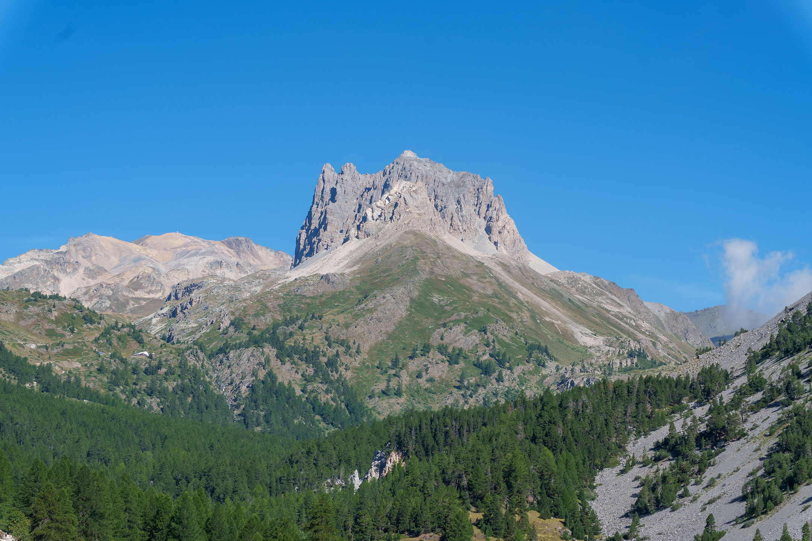
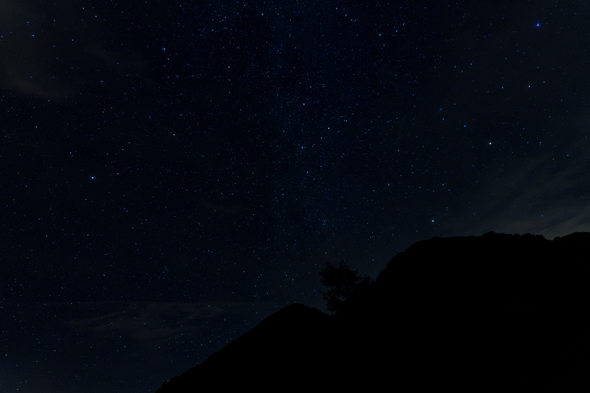
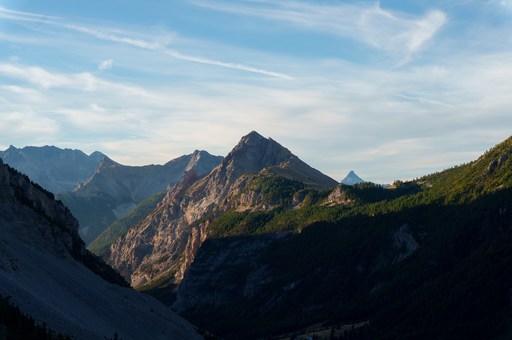
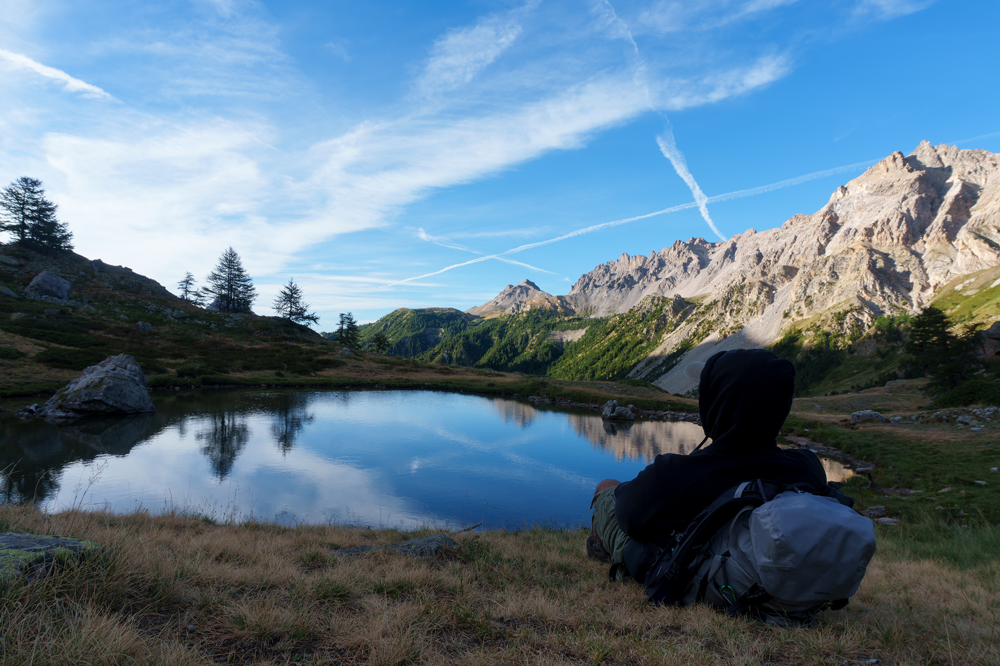

import YouTubeEmbed from "../../components/content/YouTubeEmbed.astro";

I spent two weeks in the Alps this August.
Being Italian, that's less of an expedition than it sounds. The mountains are close, and going there is an ordinary thing to do, not a once-a-year pilgrimage.
Most of those two weeks were the normal kind of holiday: towns, roads, other people, a phone with signal.

But on the 19th I took a bag, left the city I was staying in, and went up alone to sleep in the mountains.
No tent, no company, no signal. A hammock and whatever I could carry.

It was the best thing I did all year, and I want to talk about it before I try to explain why.
I filmed most of it too, so if you'd rather watch than read, the video is [further down](#the-video).

## Getting There

The valley I picked is a well-known one, and busy.
There are mountain huts along it where you can stop, rest, eat something. It's not remote, and I want to be honest about that instead of dressing this up as wilderness survival.

I started walking around two or three in the afternoon.
About an hour up, the trail opens onto a flat shelf of ground where all the climbs toward the surrounding peaks branch off.
That was where I'd sleep.

## Three Attempts at a Bedroom

I sleep in a hammock, which sounds simple until you realize it turns "where do I camp" into a geometry problem.

You need two trees.
Not too close, or the hammock hangs slack and you fold in half.
Not too far, or you can't get the tension right.
Both need to be solid.
And the ground under them shouldn't be somewhere you'd mind falling.

I moved three times before I found it.
Each time meant unpacking, looking up, sizing up two trunks, deciding no, and putting everything back.

By the third spot I stopped looking for the perfect pair of trees and took the ones that were fine.
The sun was going down and I could see it going down, and that turns out to be all the motivation you need to stop being picky.

## Water, Wood, Fire

Once the hammock was up I had two jobs, and neither could be deferred.

First, water. Boiling it so it was safe to drink.
You want water, you make fire, you wait.

Second, wood, and a lot of it.
The forecast said a low of 10°C, which doesn't sound like much written down, but I was going to be hanging in the open air and I was genuinely worried about getting cold in the night.
So I gathered far more than I thought I'd need, which turned out to be exactly the right call.

Then the fire, and dinner: a simple pasta.
Nothing clever.
It was one of the best meals I've had this year, just because of what it took to get it.

I went to bed early, around nine or ten, on the theory that if I gave myself a long enough window, some of it would turn into actual sleep.

## Midnight

I woke up around midnight, and above me was one of the most beautiful star fields I have ever seen.

I don't have anything clever to say about it.
No light pollution, no moon in the way, just an absurd number of stars, and that feeling of being very small and completely fine about it.
I lay there and looked at it for a long time before going back to sleep.

## Five in the Morning, Freezing

At five I woke up cold.
Properly cold. The kind where you know sleep is finished and negotiating with it is a waste of time.

So I got up and tried to restart the fire.
It took several attempts.
Cold hands, and everything less cooperative than it had been the night before with daylight and dry wood and no urgency.
When it finally caught I sat in front of it for about an hour doing nothing but getting warm.

That hour is one of the things I keep coming back to.
I wasn't doing anything. I was just sitting in front of a fire being cold and slowly stopping being cold, and it was completely absorbing.
Feeding it, moving closer, turning my hands over. An hour went by like that.

And then the light started coming over the ridges, which made the whole miserable cold hour feel like a fair trade.

## The Lake

The fire started dying and I decided to move rather than rebuild it.
So I packed everything up and set off toward a small lake nearby.

I was tired and I had nothing in my stomach, and I'd be lying if I said that walk was pleasant.
But around 7:30 I got to the lake, and it was extraordinary.

The sun was still behind the mountains, so it wasn't sunrise exactly. It was the thing that happens just before, where the sky does colors you don't get at any other time of day and the water holds all of them.

I even ran into two other people up there: a couple, older, all the way from Australia, who'd camped nearby in a tent.
There's something quietly funny about walking to a lake at dawn to be alone and finding two Australians already there.
It was good to talk to someone.

Then I sat down in the grass with my back against the bag and stayed there while the sun came over the ridge and the whole thing turned blue and ordinary again.
I don't know how long. Long enough that the cold finally went out of my hands.

## Going Back Down

Once I'd recovered a bit I started back: about two hours of walking, plus another hour to get home.

I arrived destroyed.
Legs gone, no sleep, no real food.
It was the best part of the two weeks.

## The Video

I filmed the whole thing. If you want to see the place instead of reading my description of it, the hammock, the fire, the lake at dawn, it's all here.

<YouTubeEmbed videoid="uCRr4VcfhHw" title="Two days camping alone in the Alps" />

## Coming Back

Everything above is just what happened, and honestly that's the part I care about.
None of it felt like it was about my job at the time. I wasn't up there thinking about work. I was thinking about trees, and wood, and whether I was going to be cold.

But I came back different in a way I noticed within about a day of sitting down again, so here's the part where I try to explain it.
Not as a productivity hack. I don't think going outside makes me ship faster on Monday, and I'd rather not turn a mountain into a tool for improving my output.
It's more that I spend most of my weeks in the same room, at the same desk, and those two days made a few things about that very obvious.

**Everything cost something.** Water meant gathering wood and making fire and waiting. Not being cold meant collecting more wood than I thought I needed. Two days where every single thing I wanted had to be earned by moving my body, which is not how any other part of my life works anymore.

**It fixed my sense of scale.** A production bug feels enormous at 11pm in a dark room. After a night under that many stars it feels like what it is, a solvable problem in a system I built.

**It gave my attention a floor.** Software work is one long invitation to be interrupted, and I'd gotten very good at saying yes. An hour in front of a fire with one job reminded me what undivided attention feels like, which made it obvious how fragmented my normal day is.

**It reminded me that I have a body.** I spend most of the week being essentially a pair of eyes and ten fingers attached to a chair. For most of the year my eyes live 60 centimeters from a screen. Walking back down that valley, having something to focus on that was kilometers away, I could feel how much I'd been missing it.

**It made boredom available again.** The best ideas I've had about my own projects didn't arrive while I was staring at the problem. They came in the shower, on a walk, half-asleep. I've been killing off those gaps by filling every one of them with a screen. Out there the gaps were unavoidable.

## Two Days, One Bag

The desk is still where the work happens, and I like the work.
But the room I do it in isn't enough on its own.
Something about this job pulls me toward a very narrow way of existing. Indoors, seated, close-focused, always reachable. And it doesn't correct for that by itself.
You have to go and correct it deliberately.

Out of fourteen days in the Alps, those were the two I actually remember.
Next time I'll give it more than two.
